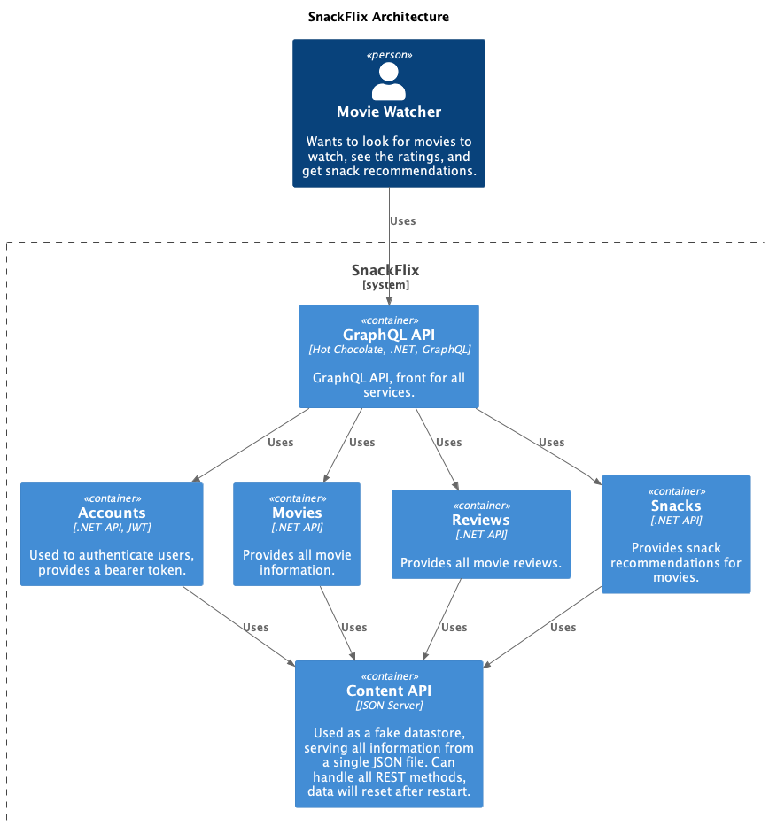

# GraphQL is cooler than (the) REST!

This repository is used to demonstrate GraphQL, using [HotChocolate GraphQL](https://hotchocolate.io/), a .NET library for building GraphQL APIs.

The goal of the application is simple: you can view movies and their ratings, and get snack recommendations based on the movie you're watching. This is how the architecture looks like:



## Features

- Queries: Fetch movies, with ratings and snack recommendations.
- Mutations: Add, update or delete ratings.
- Subscriptions: Get notified when movie is rated.
- Resolvers: Fetch snack recommendations based on movie.
- Data Loaders: Fetch movie ratings more efficiently.
- Authentication & Authorization: Secure login, review management, and role-based access control.

## Getting started

### Prerequisites

- [.NET 9 SDK](https://dotnet.microsoft.com/download/dotnet/9.0)
- [Docker](https://www.docker.com/get-started)

### Installation

1. Clone the repository
```bash
git clone https://github.com/jacobduijzer/graphql-is-cooler-than-rest.git
cd graphql-is-cooler-than-rest
```
2. Install dependencies
```bash
dotnet restore
```
3. Run the application
```bash
dotnet run --project src/Snackflix.AppHost --no-restore
```
4. Open the GraphQL Playground by clicking on the URL in the console.
5. Wait for all resources to start, then open the Api url in your browser, by clicking on the URL of the SnackFlix.Api project (see image).


## Movies

A simple list with all available movies:
```graphql
query movies {
  movies {
    title
  }
}
```

A list with all movies, including the ratings and snack recommendations:
```graphql
query allMoviesWithRatingsAndSnackRecommendations {
  movies {
    title
    snacks
    ratings {
      rating
    }
  }
}
```

The same query, but now using a data resolver, to make the queries more efficient. Look at the tracings on the Aspire dashboard to see the difference:
```graphql
query moviesWithOptimizedRatings {
  movies {
    title
    snacks
    optimizedRatings {
      rating
    }
  }
}
```

A single movie can be viewed with a parameterized query:

```graphql
query movie {
  movie(id: 1) {
    title
    snacks
    ratings {
      rating
    }
  }
}
```


## TODO List

- [x] Queries
    - [x] Movies
    - [x] Snack recommendations
    - [x] Ratings
- [x] Mutations
    - [x] Add rating for movie 
- [x] Subscriptions
    - [x] Rating added for movie
- [x] Resolvers
    - [x] Snack recommendations 
    - [x] Ratings
- [x] Data Loaders
  - [x] Movie ratings 
- [ ] Authentication & Authorization
  - [x] Login 
  - [x] Add Review (customer)
  - [ ] Edit review (only my own reviews)
  - [x] Remove (admin, roles)

## Movies

## Reviews / Ratings

## Accounts

```graphql
query movies {
    # all genres as a list
    genres

    # all movie titles and id's
    a: movies {
        id
        title
    }

    # the information of the movie with id 1
    movie(id: 1) {
        title
        year
        genres
        ratings
        description
    }

    # the titles of movies with genre Action
    moviesByGenre(genre: "Action") {
        title
    }

    # all movie titles, filtered by genre, should equal "Action"
    b: movies(where:  {
        genres:  {
            some:  {
                eq: "Action"
            }
        }
    }) {
        title
    }
}
```

## Links

- [HotChocolate GraphQL](https://hotchocolate.io/)
- [GraphQL](https://graphql.org/)
